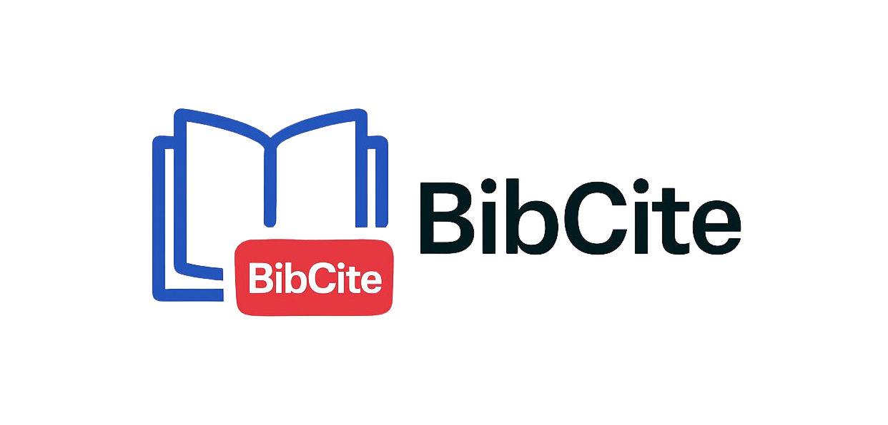

# **BibCite: 1-Click BibTeX for Google Scholar**

<p align="center">
  <a href="#"></a>
</p>

<p align="center">
    <a href="https://github.com/mohitpaddhariya/bibcite/stargazers"></a>
    <a href="https://github.com/mohitpaddhariya/bibcite/issues"></a>
    <a href="https://github.com/mohitpaddhariya/bibcite/blob/main/LICENSE"></a>
</p>

> **BibCite** is a lightweight browser extension that supercharges your research workflow on Google Scholar. It adds a direct "BibTeX" button to each search result, letting you instantly save and manage citations without extra clicks or popups.

---

## **Why BibCite?**

The standard process for getting a BibTeX citation from Google Scholar involves multiple steps: click "Cite," wait for a popup, then click "BibTeX," which opens a new page you have to copy from. This interrupts your research flow.

BibCite eliminates these extra steps. It provides a **direct, one-click button** to fetch and save the BibTeX data instantly in the background, keeping you on the search results page. It's built to be fast, simple, and unobtrusive.

## **Live Demo**

<video src="https://github.com/user-attachments/assets/1be40b1a-18b0-444d-9589-0ba22e76df84" controls width="600" alt="BibCite Demo Video"></video>

---

## **Key Features**


* 🖱️ **One-Click Saving**: A "BibTeX" button appears directly on the Google Scholar search results.
* ⚡ **Instant Access**: Fetches and saves the complete BibTeX citation in the background.
* 📋 **View, Edit & Copy**: A simple popup to view, modify, and copy the last saved citation.
* 🌊 **Seamless Workflow**: No more disruptive popups or new tabs. Stay focused on your research.
* 💾 **Persistent Storage**: Your last citation is saved locally and remains available until you save a new one or clear it.

---

## **Installation**

### **Official Release**


BibCite is now available on the Chrome Web Store!

<p>
  <a href="hthttps://chromewebstore.google.com/detail/bibcite-1-click-bibtex-fo/ilgndeefmbeoeladbjfjaifbelcdkbah" target="_blank">
    
  </a>
</p>

### **Manual Installation (for Developers)**

If you want to try it now or contribute to the project, you can load it manually:

1.  **Clone the repository:**
    ```bash
    git clone https://github.com/mohitpaddhariya/bibcite.git
    cd bibcite
    ```
2.  **Open Chrome Extensions:**
    Navigate to `chrome://extensions` in your browser.
3.  **Enable Developer Mode:**
    Turn on the "Developer mode" toggle, usually in the top-right corner.
4.  **Load the Extension:**
    Click the **"Load unpacked"** button and select the cloned `bibcite` directory. The BibCite icon should now appear in your browser's toolbar!

---

## **How It Works**

1.  Navigate to [Google Scholar](https://scholar.google.com/).
2.  Find an article you wish to cite.
3.  Click the new **"BibTeX"** button next to the result. The button will briefly show "Saved!" to confirm.
4.  Click the **BibCite extension icon** in your browser's toolbar.
5.  A popup will appear showing the full BibTeX citation. You can edit the content directly.
6.  Click **"Copy"** to add the citation to your clipboard or **"Clear"** to remove it.

---

## **Contributing**

Contributions are welcome! If you have suggestions or improvements, please open an issue to discuss your idea or submit a pull request.

To contribute, please follow these steps:

1.  **Fork** the repository.
2.  Create a new branch for your feature (`git checkout -b feature/amazing-feature`).
3.  Make your changes and commit them (`git commit -m 'Add some amazing feature'`).
4.  Push your changes to the branch (`git push origin feature/amazing-feature`).
5.  Open a **Pull Request**.

---

## **License**

This project is licensed under the MIT License. See the [LICENSE](LICENSE) file for details.
